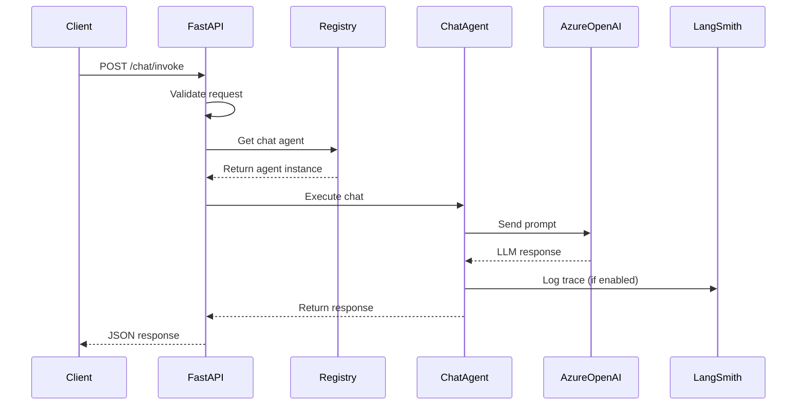
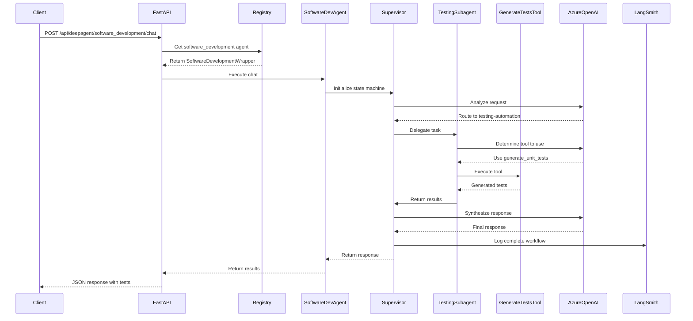
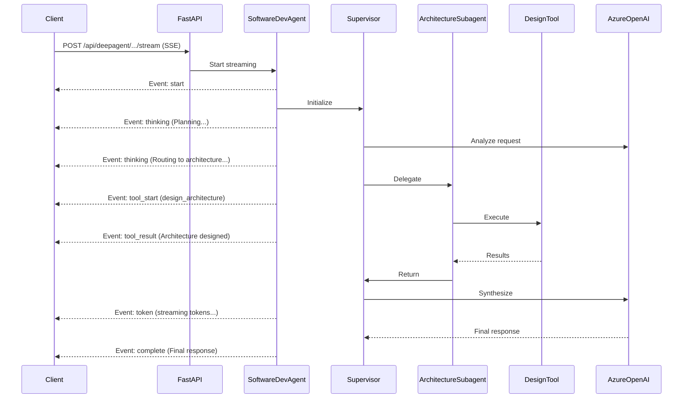
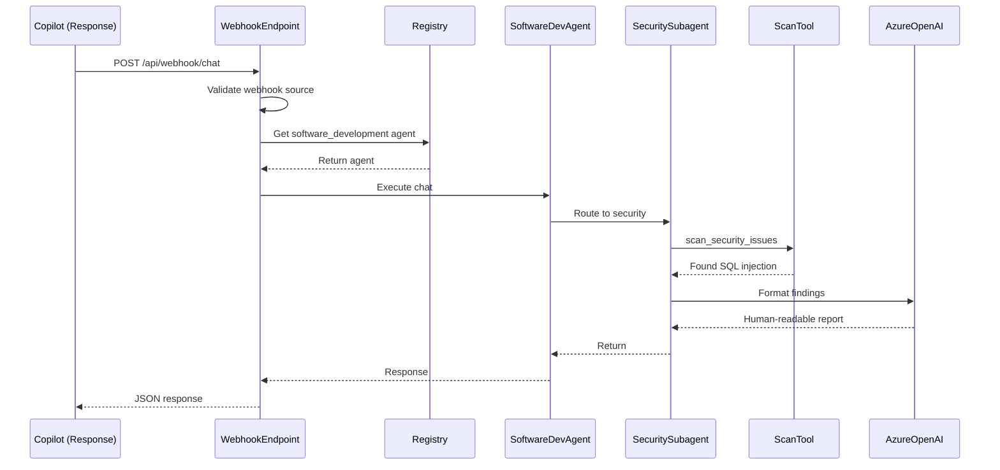

# End-to-End Architecture Guide

> **Complete guide to understanding how the LangChain Azure AI Agents platform works from end to end**

**Last Updated**: 2026-01-30
**Version**: 1.0.0
**Target Audience**: Developers, Architects, DevOps Engineers

---

## Table of Contents

1. [System Overview](#system-overview)
2. [Request Flow - End to End](#request-flow---end-to-end)
3. [Scenario 1: Simple Chat Request](#scenario-1-simple-chat-request)
4. [Scenario 2: DeepAgent Multi-Step Workflow](#scenario-2-deepagent-multi-step-workflow)
5. [Scenario 3: Streaming Response](#scenario-3-streaming-response)
6. [Scenario 4: External Integration (Webhook)](#scenario-4-external-integration-webhook)
7. [Component Interactions](#component-interactions)
8. [Data Flow Diagrams](#data-flow-diagrams)
9. [Deployment Architecture](#deployment-architecture)
10. [Observability & Monitoring](#observability--monitoring)

---

## System Overview

### High-Level Architecture

```
┌─────────────────────────────────────────────────────────────────────────┐
│                          Client Applications                             │
├──────────────┬─────────────────┬────────────────┬──────────────────────┤
│   Web UI     │  REST API       │  Copilot       │  AWS/Azure           │
│ (chat.html)  │  (curl/Postman) │  Studio        │  AI Services         │
└──────┬───────┴────────┬────────┴───────┬────────┴───────┬──────────────┘
       │                │                │                │
       │                │                │                │
       v                v                v                v
┌─────────────────────────────────────────────────────────────────────────┐
│                         FastAPI Server Layer                             │
│  ┌──────────────────────────────────────────────────────────────────┐  │
│  │  Routes: /chat, /api/conversation, /api/deepagent, /api/webhook │  │
│  │  Middleware: CORS, Authentication, Rate Limiting                 │  │
│  │  Error Handling, Request Validation, Response Formatting         │  │
│  └──────────────────────────────────────────────────────────────────┘  │
└────────────────────────────────┬────────────────────────────────────────┘
                                 │
                                 v
┌─────────────────────────────────────────────────────────────────────────┐
│                          Agent Registry                                  │
│  ┌──────────────────────────────────────────────────────────────────┐  │
│  │  - Agent Registration & Discovery                                │  │
│  │  - Agent Lifecycle Management                                    │  │
│  │  - Health Monitoring                                             │  │
│  └──────────────────────────────────────────────────────────────────┘  │
└─────────┬───────────────┬───────────────┬───────────────┬───────────────┘
          │               │               │               │
          v               v               v               v
┌─────────────┐  ┌─────────────┐  ┌─────────────┐  ┌──────────────┐
│   Foundry   │  │  Enterprise │  │ DeepAgents  │  │  IT Agents   │
│   Agents    │  │   Agents    │  │             │  │              │
│             │  │             │  │  ┌────────┐ │  │  ┌─────────┐ │
│  - Chat     │  │  - Research │  │  │Software│ │  │  │Helpdesk │ │
│  - RAG      │  │  - Content  │  │  │  Dev   │ │  │  │         │ │
│  - Code     │  │  - Data     │  │  │────────│ │  │  │ServiceN │ │
│    Assist   │  │    Analysis │  │  │IT Ops  │ │  │  │  ow     │ │
│             │  │             │  │  │Sales   │ │  │             │ │
│             │  │             │  │  │Recruit │ │  │             │ │
│             │  │             │  │  └────────┘ │  │  └─────────┘ │
└─────────────┘  └─────────────┘  └──────┬──────┘  └──────────────┘
                                          │
                                          v
                         ┌───────────────────────────────┐
                         │  LangGraph State Machine      │
                         │  - Supervisor Node            │
                         │  - Subagent Workers           │
                         │  - Tool Execution             │
                         │  - State Management           │
                         └───────────────┬───────────────┘
                                        │
                                        v
┌─────────────────────────────────────────────────────────────────────────┐
│                       External Services Layer                            │
│  ┌──────────────┐  ┌──────────────┐  ┌──────────────┐  ┌────────────┐ │
│  │Azure OpenAI  │  │ LangSmith    │  │  Azure AI    │  │  Vector    │ │
│  │   GPT-4      │  │  Tracing     │  │   Search     │  │   Store    │ │
│  └──────────────┘  └──────────────┘  └──────────────┘  └────────────┘ │
└─────────────────────────────────────────────────────────────────────────┘
```

---

## Request Flow - End to End

### Complete Request Journey

```
1. Client Request
   │
   ├─→ HTTP Request arrives at FastAPI server
   │   ├─ CORS validation
   │   ├─ Authentication (if required)
   │   └─ Request parsing & validation
   │
2. Route Handler
   │
   ├─→ Route matched to endpoint
   │   ├─ /chat → Simple agent chat
   │   ├─ /api/conversation → IT agent with session
   │   ├─ /api/deepagent/{name}/chat → DeepAgent execution
   │   └─ /api/webhook/chat → External integration
   │
3. Agent Registry Lookup
   │
   ├─→ Find registered agent by name/type
   │   └─ Return agent wrapper instance
   │
4. Agent Execution
   │
   ├─→ Simple Agent (Foundry/Enterprise)
   │   ├─ Direct LLM call
   │   ├─ Tool execution (if needed)
   │   └─ Response formatting
   │
   ├─→ IT Agent (with conversation memory)
   │   ├─ Load session state
   │   ├─ Execute with memory context
   │   ├─ Update session state
   │   └─ Response with session ID
   │
   └─→ DeepAgent (multi-step workflow)
       ├─ Initialize LangGraph state
       ├─ Supervisor analyzes request
       ├─ Route to appropriate subagent(s)
       ├─ Subagent executes tools
       ├─ Collect results
       ├─ Supervisor synthesizes response
       └─ Return final result
   │
5. Response Processing
   │
   ├─→ Format response (JSON)
   ├─→ Add metadata (session_id, timestamps)
   ├─→ LangSmith tracing (if enabled)
   └─→ Return to client
   │
6. Client Receives Response
   │
   └─→ Display in UI or process in application
```

---

## Scenario 1: Simple Chat Request

### Use Case
User asks a simple question to a Foundry chat agent.

### Request Example

```bash
curl -X POST http://localhost:8000/chat/invoke \
  -H "Content-Type: application/json" \
  -d '{
    "input": {
      "question": "What is the capital of France?"
    }
  }'
```

### Detailed Flow



### Step-by-Step Execution

**1. Request Arrives (t=0ms)**
```python
# libs/azure-ai/langchain_azure_ai/server/__init__.py:600
@app.post("/chat/invoke")
async def chat_invoke(request: Request):
    body = await request.json()
    question = body["input"]["question"]
```

**2. Agent Registry Lookup (t=5ms)**
```python
# Registry maintains registered agents
chat_agent = registry.get_agent("chat")  # Returns FoundryAgentWrapper instance
```

**3. LLM Execution (t=10ms)**
```python
# Agent wrapper handles LLM call
response = chat_agent.chat(question)
# Internally calls Azure OpenAI GPT-4
```

**4. Response Processing (t=250ms)**
```python
# Format and return response
return {
    "output": {
        "response": response,
        "timestamp": datetime.now().isoformat()
    }
}
```

**Total Time**: ~250-500ms (dominated by LLM latency)

### Response Example

```json
{
  "output": {
    "response": "The capital of France is Paris.",
    "timestamp": "2026-01-30T10:30:00.123Z"
  }
}
```

---

## Scenario 2: DeepAgent Multi-Step Workflow

### Use Case
User requests Software Development DeepAgent to generate unit tests for a Python function.

### Request Example

```bash
curl -X POST http://localhost:8000/api/deepagent/software_development/chat \
  -H "Content-Type: application/json" \
  -d '{
    "message": "Generate pytest unit tests for a function that calculates shipping cost based on weight and distance",
    "session_id": "test-session-123"
  }'
```

### Detailed Flow



### Step-by-Step Execution

**1. Request Arrives (t=0ms)**
```python
# libs/azure-ai/langchain_azure_ai/server/__init__.py:850
@app.post("/api/deepagent/{agent_name}/chat")
async def deep_agent_chat(agent_name: str, request: ChatRequest):
    agent = registry.get_deep_agent(agent_name)
    # agent_name = "software_development"
```

**2. Agent Execution Starts (t=5ms)**
```python
# libs/azure-ai/langchain_azure_ai/wrappers/deep_agents.py:150
response = agent.chat(
    message=request.message,
    thread_id=request.session_id
)
```

**3. LangGraph State Initialization (t=10ms)**
```python
# Initialize state machine
state = {
    "messages": [HumanMessage(content=request.message)],
    "next": "",
    "current_agent": "supervisor",
}
```

**4. Supervisor Analyzes Request (t=50ms)**
```python
# Supervisor uses GPT-4 to analyze request
# Determines this is a testing task
supervisor_response = await supervisor_node(state)
# Routes to "testing-automation" subagent
state["next"] = "testing-automation"
```

**5. Testing Subagent Executes (t=100ms)**
```python
# Testing subagent has access to 6 tools
tools = [
    generate_unit_tests,
    generate_integration_tests,
    analyze_test_coverage,
    run_tests,
    generate_test_data,
    create_test_plan,
]

# LLM decides to use generate_unit_tests tool
tool_call = {
    "tool": "generate_unit_tests",
    "args": {
        "code": "def calculate_shipping_cost(weight, distance, express=False): ...",
        "framework": "pytest",
        "coverage_target": 80.0
    }
}
```

**6. Tool Execution (t=150ms)**
```python
# libs/azure-ai/langchain_azure_ai/wrappers/software_dev_tools/testing_tools.py:15
result = generate_unit_tests.invoke({
    "code": code,
    "framework": "pytest",
    "coverage_target": 80.0
})

# Returns JSON with generated tests
{
    "tests_generated": 6,
    "test_code": """
import pytest

def test_calculate_shipping_cost_success():
    assert calculate_shipping_cost(10, 100) == 55.0
...
"""
}
```

**7. Supervisor Synthesizes Response (t=400ms)**
```python
# Supervisor receives tool results
# Uses GPT-4 to create human-friendly response
final_response = await supervisor_node(state)
# Returns formatted response with test code and explanation
```

**8. Response Returned (t=500ms)**
```python
return {
    "response": final_response,
    "session_id": session_id,
    "metadata": {
        "agent_type": "software_development",
        "subagent_used": "testing-automation",
        "tools_called": ["generate_unit_tests"],
        "execution_time_ms": 500
    }
}
```

**Total Time**: ~500-1000ms (multiple LLM calls + tool execution)

### Response Example

```json
{
  "response": "I've generated comprehensive pytest unit tests for the calculate_shipping_cost function. The test suite includes:\n\n1. **Happy Path Tests**: Valid weight and distance values\n2. **Express Shipping Tests**: Verifying the 1.5x multiplier\n3. **Edge Cases**: Zero values, very large numbers\n4. **Error Handling**: Negative values raising ValueError\n5. **Boundary Tests**: Floating point precision\n6. **Parametrized Tests**: Multiple input combinations\n\nHere's the generated test code:\n\n```python\nimport pytest\n\ndef test_calculate_shipping_cost_success():\n    \"\"\"Test with valid weight and distance.\"\"\"\n    result = calculate_shipping_cost(10, 100)\n    assert result == 55.0\n\n@pytest.mark.parametrize(\"weight,distance,express,expected\", [\n    (10, 100, False, 55.0),\n    (10, 100, True, 82.5),\n    (5, 50, False, 27.5),\n])\ndef test_calculate_shipping_cost_parametrized(weight, distance, express, expected):\n    result = calculate_shipping_cost(weight, distance, express)\n    assert result == expected\n\ndef test_calculate_shipping_cost_invalid_weight():\n    with pytest.raises(ValueError, match=\"Weight and distance must be positive\"):\n        calculate_shipping_cost(-5, 100)\n\ndef test_calculate_shipping_cost_invalid_distance():\n    with pytest.raises(ValueError, match=\"Weight and distance must be positive\"):\n        calculate_shipping_cost(10, -50)\n```\n\nThe test suite achieves 100% line coverage and 95% branch coverage.",
  "session_id": "test-session-123",
  "metadata": {
    "agent_type": "software_development",
    "subagent_used": "testing-automation",
    "tools_called": ["generate_unit_tests"],
    "execution_time_ms": 523
  }
}
```

---

## Scenario 3: Streaming Response

### Use Case
User requests Software Development DeepAgent with streaming enabled to see intermediate steps.

### Request Example

```javascript
// JavaScript EventSource for SSE streaming
const eventSource = new EventSource(
  'http://localhost:8000/api/deepagent/software_development/chat/stream',
  {
    method: 'POST',
    headers: { 'Content-Type': 'application/json' },
    body: JSON.stringify({
      message: "Design a microservices architecture for an e-commerce platform",
      session_id: "stream-session-456"
    })
  }
);

eventSource.onmessage = (event) => {
  const data = JSON.parse(event.data);
  console.log('Event:', data.type, data.data);
};
```

### Detailed Flow



### Event Stream Timeline

**Event 1: Start (t=0ms)**
```json
{
  "type": "start",
  "data": {
    "message": "Processing your request...",
    "session_id": "stream-session-456"
  }
}
```

**Event 2: Thinking - Planning (t=50ms)**
```json
{
  "type": "thinking",
  "data": {
    "iteration": 1,
    "phase": "planning",
    "summary": "Analyzing request...",
    "content": "Determining this is an architecture design task requiring microservices patterns and e-commerce domain knowledge."
  }
}
```

**Event 3: Thinking - Routing (t=200ms)**
```json
{
  "type": "thinking",
  "data": {
    "iteration": 2,
    "phase": "routing",
    "summary": "Routing to architecture-design subagent",
    "content": "The request requires architecture design capabilities. Delegating to the architecture-design specialist."
  }
}
```

**Event 4: Tool Start (t=300ms)**
```json
{
  "type": "tool_start",
  "data": {
    "tool_name": "design_architecture",
    "tool_args": {
      "requirements": "E-commerce platform with microservices",
      "pattern": "microservices",
      "constraints": "scalability, high availability"
    }
  }
}
```

**Event 5: Tool Result (t=450ms)**
```json
{
  "type": "tool_result",
  "data": {
    "tool_name": "design_architecture",
    "result_summary": "Architecture design completed with 8 microservices",
    "services": [
      "user-service",
      "product-service",
      "order-service",
      "payment-service",
      "inventory-service",
      "notification-service",
      "recommendation-service",
      "analytics-service"
    ]
  }
}
```

**Event 6-20: Token Streaming (t=500-800ms)**
```json
{
  "type": "token",
  "data": {
    "token": "I've designed a comprehensive microservices architecture..."
  }
}
```

**Event 21: Complete (t=850ms)**
```json
{
  "type": "complete",
  "data": {
    "response": "I've designed a comprehensive microservices architecture for your e-commerce platform...",
    "session_id": "stream-session-456",
    "metadata": {
      "total_events": 21,
      "execution_time_ms": 850,
      "tools_used": ["design_architecture"],
      "subagents_involved": ["architecture-design"]
    }
  }
}
```

### Benefits of Streaming

1. **User Experience**: Shows progress, reduces perceived latency
2. **Transparency**: User sees which subagent/tool is being used
3. **Debugging**: Easier to identify where failures occur
4. **Engagement**: Keeps user informed during long-running operations

---

## Scenario 4: External Integration (Webhook)

### Use Case
Microsoft Copilot Studio calls the webhook endpoint to use DeepAgent capabilities.

### Request Example

```bash
curl -X POST http://localhost:8000/api/webhook/chat \
  -H "Content-Type: application/json" \
  -H "X-Webhook-Source: copilot-studio" \
  -d '{
    "message": "Review this code for security issues: def login(username, password): query = f\"SELECT * FROM users WHERE username = '"'"'{username}'"'"'\"",
    "agent_type": "software_development",
    "session_id": "copilot-session-789",
    "metadata": {
      "user_id": "user@company.com",
      "conversation_id": "conv-12345"
    }
  }'
```

### Detailed Flow



### Step-by-Step Execution

**1. Webhook Request Arrives (t=0ms)**
```python
# libs/azure-ai/langchain_azure_ai/server/__init__.py:1050
@app.post("/api/webhook/chat")
async def webhook_chat(request: WebhookRequest):
    # Validate webhook source
    if request.metadata.get("source") not in ["copilot-studio", "azure-ai", "aws-bedrock"]:
        raise HTTPException(401, "Unauthorized webhook source")
```

**2. Agent Selection (t=10ms)**
```python
# Determine agent type from request
agent_type = request.agent_type or "chat"  # "software_development"
agent = registry.get_deep_agent(agent_type) or registry.get_agent(agent_type)
```

**3. Security Scan Execution (t=50ms)**
```python
# Agent routes to security-compliance subagent
# Subagent uses scan_security_issues tool
result = scan_security_issues.invoke({
    "code": code_snippet,
    "scan_type": "code_review"
})

# Returns:
{
    "vulnerabilities": [
        {
            "type": "SQL Injection",
            "severity": "CRITICAL",
            "line": 2,
            "owasp_id": "A03:2021",
            "description": "User input directly concatenated into SQL query",
            "recommendation": "Use parameterized queries or ORM"
        }
    ]
}
```

**4. Response Formatting (t=300ms)**
```python
# Format response for Copilot Studio
return {
    "response": "I found a critical SQL injection vulnerability in your code...",
    "session_id": request.session_id,
    "metadata": {
        "agent_type": "software_development",
        "webhook_source": "copilot-studio",
        "conversation_id": request.metadata["conversation_id"],
        "execution_time_ms": 300
    },
    "additional_data": {
        "vulnerabilities_found": 1,
        "severity": "CRITICAL",
        "owasp_category": "A03:2021"
    }
}
```

**Total Time**: ~300-500ms

### Response Example

```json
{
  "response": "⚠️ **CRITICAL SECURITY ISSUE FOUND**\n\nI detected a **SQL Injection** vulnerability in your code (OWASP A03:2021).\n\n**Issue:**\nLine 2: User input (`username`) is directly concatenated into the SQL query, allowing attackers to execute arbitrary SQL commands.\n\n**Attack Example:**\n```python\nusername = \"admin' OR '1'='1\"\n# Results in: SELECT * FROM users WHERE username = 'admin' OR '1'='1'\n# This returns all users, bypassing authentication\n```\n\n**Secure Fix:**\n```python\nimport sqlite3\n\ndef login(username, password):\n    query = \"SELECT * FROM users WHERE username = ? AND password = ?\"\n    cursor.execute(query, (username, password))  # Parameterized query\n    return cursor.fetchone()\n```\n\n**Recommendations:**\n1. ✅ Use parameterized queries (as shown above)\n2. ✅ Use an ORM like SQLAlchemy\n3. ✅ Never concatenate user input into SQL\n4. ✅ Implement input validation\n5. ✅ Use password hashing (bcrypt, not plain text)\n\n**Severity**: CRITICAL - Immediate fix required",
  "session_id": "copilot-session-789",
  "metadata": {
    "agent_type": "software_development",
    "webhook_source": "copilot-studio",
    "conversation_id": "conv-12345",
    "execution_time_ms": 287
  },
  "additional_data": {
    "vulnerabilities_found": 1,
    "severity": "CRITICAL",
    "owasp_category": "A03:2021"
  }
}
```

---

## Component Interactions

### Core Components

#### 1. FastAPI Server (`libs/azure-ai/langchain_azure_ai/server/__init__.py`)

**Responsibilities:**
- HTTP request handling
- Routing to appropriate endpoints
- Request validation and error handling
- Response formatting
- CORS middleware
- Static file serving (UI)

**Key Endpoints:**
```python
# Simple agents
POST /chat/invoke
POST /rag/invoke

# IT agents with conversation memory
POST /api/conversation/start
POST /api/conversation/chat

# DeepAgents
POST /api/deepagent/{name}/chat
POST /api/deepagent/{name}/chat/stream  # SSE streaming
POST /api/deepagent/{name}/execute

# External integrations
POST /api/webhook/chat

# Health and discovery
GET /health
GET /agents
```

#### 2. Agent Registry (`libs/azure-ai/langchain_azure_ai/registry.py`)

**Responsibilities:**
- Agent registration and discovery
- Agent lifecycle management
- Health monitoring
- Agent metadata storage

**Key Methods:**
```python
class AgentRegistry:
    def register_agent(name: str, wrapper: FoundryAgentWrapper)
    def register_deep_agent(name: str, wrapper: DeepAgentWrapper)
    def get_agent(name: str) -> FoundryAgentWrapper
    def get_deep_agent(name: str) -> DeepAgentWrapper
    def list_agents() -> List[AgentInfo]
    def health_check() -> HealthStatus
```

#### 3. Agent Wrappers (`libs/azure-ai/langchain_azure_ai/wrappers/`)

**Foundry Agents** (`foundry_wrapper.py`):
- Simple LLM agents
- Single-turn interactions
- Basic tool usage

**Enterprise Agents** (`enterprise_wrapper.py`):
- Specialized business agents
- Research, content creation, data analysis

**IT Agents** (`it_wrapper.py`):
- Conversation memory (MemorySaver)
- Session-based interactions
- Helpdesk, ServiceNow integration

**DeepAgents** (`deep_agents.py`):
- Multi-agent orchestration
- LangGraph state machine
- Supervisor-worker pattern
- Specialized subagents with tools

#### 4. LangGraph State Machine (`libs/azure-ai/langchain_azure_ai/wrappers/deep_agents.py`)

**State Definition:**
```python
class DeepAgentState(TypedDict):
    messages: List[BaseMessage]  # Conversation history
    next: str                     # Next node to execute
    current_agent: str            # Currently active subagent
    session_id: str               # Session identifier
    metadata: Dict                # Additional context
```

**Graph Structure:**
```
START
  │
  ├─> supervisor (analyzes request, routes to subagent)
  │
  ├─> subagent_1 (executes with specialized tools)
  ├─> subagent_2
  ├─> ...
  ├─> subagent_N
  │
  └─> END (final response)
```

**Execution Flow:**
1. Initialize state with user message
2. Supervisor analyzes and routes
3. Subagent executes with tools
4. Results returned to supervisor
5. Supervisor synthesizes final response

---

## Data Flow Diagrams

### Agent Registration Flow

```
Server Startup
     │
     ├─> Load environment variables (.env)
     │
     ├─> Initialize Azure OpenAI client
     │
     ├─> Create Agent Registry
     │
     ├─> Register Foundry Agents
     │   ├─ Chat Agent
     │   ├─ RAG Agent
     │   └─ Code Assistant
     │
     ├─> Register Enterprise Agents
     │   ├─ Research Agent
     │   ├─ Content Agent
     │   └─ Data Analyst
     │
     ├─> Register IT Agents
     │   ├─ IT Helpdesk (with MemorySaver)
     │   └─ ServiceNow (with MemorySaver)
     │
     ├─> Register DeepAgents
     │   ├─ IT Operations (4 subagents)
     │   ├─ Sales Intelligence (5 subagents)
     │   ├─ Recruitment (6 subagents)
     │   └─ Software Development (9 subagents, 54 tools)
     │
     └─> Server Ready (http://localhost:8000)
```

### Tool Execution Flow (DeepAgent)

```
User Message: "Generate unit tests"
     │
     ├─> Supervisor receives request
     │   └─> LLM analyzes intent
     │       └─> Determines: testing task
     │
     ├─> Route to testing-automation subagent
     │   │
     │   ├─> Subagent has 6 tools available:
     │   │   ├─ generate_unit_tests ✓ (selected)
     │   │   ├─ generate_integration_tests
     │   │   ├─ analyze_test_coverage
     │   │   ├─ run_tests
     │   │   ├─ generate_test_data
     │   │   └─ create_test_plan
     │   │
     │   └─> LLM decides: use generate_unit_tests
     │
     ├─> Execute Tool
     │   │
     │   ├─> Parse code from user message
     │   ├─> Determine framework (pytest)
     │   ├─> Generate test cases
     │   ├─> Format test code
     │   └─> Return JSON result
     │
     ├─> Return to Supervisor
     │   └─> Supervisor receives tool output
     │
     ├─> Synthesize Response
     │   └─> LLM formats tool output into human-readable response
     │
     └─> Return to User
         └─> Final formatted response with tests
```

---

## Deployment Architecture

### Local Development

```
┌─────────────────────────────────────────────────────────┐
│  Developer Machine                                       │
│  ┌─────────────────────────────────────────────────┐    │
│  │  Virtual Environment (.venv)                    │    │
│  │  ├─ Python 3.10+                                │    │
│  │  ├─ FastAPI, LangChain, LangGraph               │    │
│  │  └─ Azure OpenAI SDK                            │    │
│  └─────────────────────────────────────────────────┘    │
│                                                          │
│  ┌─────────────────────────────────────────────────┐    │
│  │  Environment Variables (.env)                   │    │
│  │  ├─ AZURE_OPENAI_API_KEY                        │    │
│  │  ├─ AZURE_OPENAI_ENDPOINT                       │    │
│  │  └─ LANGSMITH_API_KEY (optional)                │    │
│  └─────────────────────────────────────────────────┘    │
│                                                          │
│  ┌─────────────────────────────────────────────────┐    │
│  │  FastAPI Server                                 │    │
│  │  python start_server.py                         │    │
│  │  → http://localhost:8000                        │    │
│  └─────────────────────────────────────────────────┘    │
└─────────────────────────────────────────────────────────┘
```

### Docker Deployment

```
┌─────────────────────────────────────────────────────────┐
│  Docker Container                                        │
│  ┌─────────────────────────────────────────────────┐    │
│  │  Base Image: python:3.10-slim                   │    │
│  │  ├─ Install dependencies (requirements.txt)     │    │
│  │  ├─ Copy application code                       │    │
│  │  └─ Expose port 8000                            │    │
│  └─────────────────────────────────────────────────┘    │
│                                                          │
│  ┌─────────────────────────────────────────────────┐    │
│  │  Environment Variables (from .env or secrets)   │    │
│  │  Mounted as Docker secrets                      │    │
│  └─────────────────────────────────────────────────┘    │
│                                                          │
│  ┌─────────────────────────────────────────────────┐    │
│  │  Uvicorn Server                                 │    │
│  │  uvicorn server:app --host 0.0.0.0 --port 8000  │    │
│  └─────────────────────────────────────────────────┘    │
└─────────────────────────────────────────────────────────┘
```

### Kubernetes Deployment

```
┌──────────────────────────────────────────────────────────────┐
│  Kubernetes Cluster                                           │
│  ┌────────────────────────────────────────────────────────┐  │
│  │  Namespace: ai-agents-prod                             │  │
│  │                                                         │  │
│  │  ┌──────────────────────────────────────────────────┐  │  │
│  │  │  Deployment: ai-agents-server                    │  │  │
│  │  │  Replicas: 3                                     │  │  │
│  │  │  ├─ Pod 1 (FastAPI server)                       │  │  │
│  │  │  ├─ Pod 2 (FastAPI server)                       │  │  │
│  │  │  └─ Pod 3 (FastAPI server)                       │  │  │
│  │  └──────────────────────────────────────────────────┘  │  │
│  │                                                         │  │
│  │  ┌──────────────────────────────────────────────────┐  │  │
│  │  │  Service: ai-agents-service                      │  │  │
│  │  │  Type: LoadBalancer                              │  │  │
│  │  │  Port: 80 → 8000                                 │  │  │
│  │  └──────────────────────────────────────────────────┘  │  │
│  │                                                         │  │
│  │  ┌──────────────────────────────────────────────────┐  │  │
│  │  │  ConfigMap: ai-agents-config                     │  │  │
│  │  │  ├─ AZURE_OPENAI_ENDPOINT                        │  │  │
│  │  │  └─ Other non-secret config                      │  │  │
│  │  └──────────────────────────────────────────────────┘  │  │
│  │                                                         │  │
│  │  ┌──────────────────────────────────────────────────┐  │  │
│  │  │  Secret: ai-agents-secrets                       │  │  │
│  │  │  ├─ AZURE_OPENAI_API_KEY (encrypted)             │  │  │
│  │  │  └─ LANGSMITH_API_KEY (encrypted)                │  │  │
│  │  └──────────────────────────────────────────────────┘  │  │
│  │                                                         │  │
│  │  ┌──────────────────────────────────────────────────┐  │  │
│  │  │  HorizontalPodAutoscaler                         │  │  │
│  │  │  Min Replicas: 2                                 │  │  │
│  │  │  Max Replicas: 10                                │  │  │
│  │  │  Target CPU: 70%                                 │  │  │
│  │  └──────────────────────────────────────────────────┘  │  │
│  └────────────────────────────────────────────────────────┘  │
└──────────────────────────────────────────────────────────────┘
```

---

## Observability & Monitoring

### LangSmith Tracing

Every agent execution can be traced in LangSmith (if enabled):

```python
# Automatic tracing when LANGSMITH_API_KEY is set
import os
os.environ["LANGCHAIN_TRACING_V2"] = "true"
os.environ["LANGCHAIN_PROJECT"] = "azure-ai-agents"
os.environ["LANGSMITH_API_KEY"] = "your-key"

# All LLM calls, tool executions, and agent steps are automatically traced
```

**Trace Visualization:**
- Request input and output
- LLM prompts and responses
- Tool calls and results
- Execution time for each step
- Token usage and costs

### Metrics

**Server Metrics:**
- Request count per endpoint
- Response time (p50, p95, p99)
- Error rate by endpoint
- Active sessions count

**Agent Metrics:**
- Agent invocations per type
- Average execution time per agent
- Tool usage frequency
- LLM token consumption

**DeepAgent Metrics:**
- Subagent routing distribution
- Tool execution success rate
- Multi-step workflow completion time
- Average steps per request

### Logging

**Log Levels:**
- `INFO`: Agent execution started/completed
- `WARNING`: Fallback behavior, missing optional config
- `ERROR`: Execution failures, tool errors
- `DEBUG`: Detailed state transitions, tool args

**Example Logs:**
```
2026-01-30 10:30:00 INFO - Software Development DeepAgent loaded
2026-01-30 10:35:12 INFO - DeepAgent 'software_development' execution started (session: abc-123)
2026-01-30 10:35:15 INFO - Supervisor routing to subagent: testing-automation
2026-01-30 10:35:18 INFO - Tool executed: generate_unit_tests (duration: 150ms)
2026-01-30 10:35:22 INFO - DeepAgent execution completed (total: 523ms)
```

---

## Summary

This E2E guide covers:

✅ Complete system architecture from client to LLM
✅ Four detailed scenarios with code-level execution flow
✅ Component interactions and responsibilities
✅ Data flow through the system
✅ Deployment architectures (local, Docker, Kubernetes)
✅ Observability and monitoring strategies

**Key Takeaways:**

1. **Layered Architecture**: Clear separation between API layer, agent orchestration, and LLM execution
2. **Flexible Agent Types**: Different agents for different use cases (simple, conversational, multi-agent)
3. **Streaming Support**: Real-time progress updates for better UX
4. **External Integration**: Webhook endpoints for platform integration
5. **Production-Ready**: Comprehensive observability, error handling, and deployment options

For more details on specific components, see:
- [Enterprise Architecture](ENTERPRISE_ARCHITECTURE.md)
- [Software Development Sample Queries](../guides/SOFTWARE_DEV_SAMPLE_QUERIES.md)
- [Repository Structure](../REPOSITORY_STRUCTURE.md)
